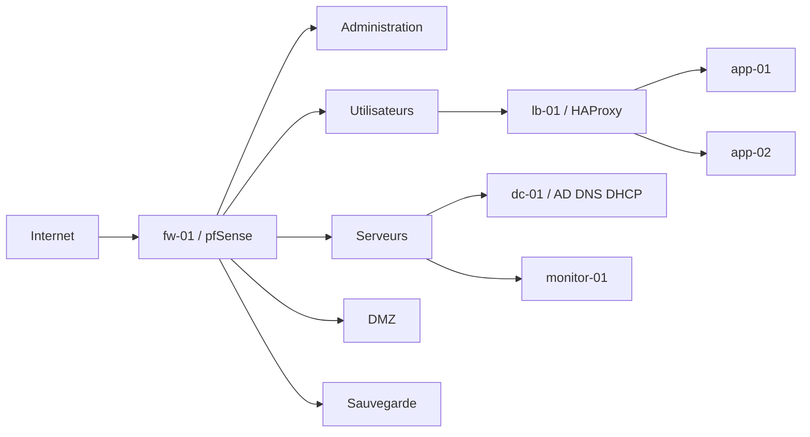

# SecureOps Enterprise Lab

## Présentation

SecureOps Enterprise Lab est un laboratoire informatique virtualisé reproduisant progressivement l'infrastructure d'une petite entreprise.

Le projet permettra de mettre en œuvre :

- la virtualisation avec VMware Workstation ;
- la segmentation réseau ;
- un pare-feu pfSense ;
- Active Directory, DNS, DHCP et les GPO ;
- des machines Ubuntu Desktop avec interface graphique ;
- une application web redondante ;
- HAProxy ;
- Ansible ;
- Prometheus, Grafana et Alertmanager ;
- un mécanisme de basculement automatique ;
- une solution de sauvegarde et de restauration.

## État du projet

Phase actuelle : conception et validation de l'architecture initiale.

## Systèmes prévus

- pfSense ;
- Windows Server ;
- Windows 11 ;
- Ubuntu Desktop.

## Architecture prévue

L'architecture initiale de SecureOps Enterprise Lab sépare les rôles dans plusieurs zones réseau afin de reproduire progressivement une infrastructure d'entreprise : administration, serveurs, utilisateurs, DMZ et sauvegarde. Toutes les futures machines Linux utiliseront Ubuntu Desktop avec interface graphique.

Cette architecture est une cible de conception. Les machines virtuelles, les réseaux VMware et les services seront créés et configurés progressivement lors des étapes suivantes.

Documents d'architecture :

- [Présentation globale](docs/architecture-overview.md)
- [Inventaire des machines](docs/inventaire-machines.md)
- [Plan d'adressage IP](docs/plan-adressage.md)
- [Matrice des flux réseau](docs/matrice-flux-reseau.md)
- [Schéma logique](diagrams/architecture-logique.md)
- [Schéma réseau](diagrams/architecture-reseau.md)
- [Flux utilisateur vers l'application](diagrams/flux-application.md)
- [Flux de basculement automatique](diagrams/flux-failover.md)
