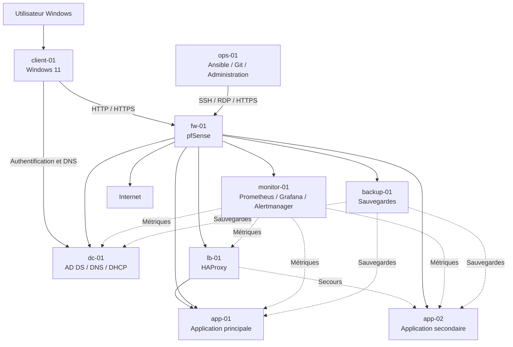

# Schéma logique de l'architecture

Ce schéma représente la logique cible du laboratoire. Les machines et les services ne sont pas encore déployés.

```mermaid
flowchart TD
    USER[Utilisateur Windows]
    CLIENT[client-01<br/>Windows 11]
    DC[dc-01<br/>AD DS / DNS / DHCP]
    LB[lb-01<br/>HAProxy]
    APP1[app-01<br/>Application principale]
    APP2[app-02<br/>Application secondaire]
    MON[monitor-01<br/>Prometheus / Grafana / Alertmanager]
    OPS[ops-01<br/>Ansible / Git / Administration]
    BACKUP[backup-01<br/>Sauvegardes]
    FW[fw-01<br/>pfSense]
    INTERNET[Internet]

    USER --> CLIENT
    CLIENT -->|Authentification et DNS| DC
    CLIENT -->|HTTP / HTTPS| FW
    FW --> LB
    LB --> APP1
    LB -. Secours .-> APP2

    OPS -->|SSH / RDP / HTTPS| FW
    FW --> DC
    FW --> APP1
    FW --> APP2
    FW --> MON
    FW --> BACKUP

    MON -. Métriques .-> DC
    MON -. Métriques .-> APP1
    MON -. Métriques .-> APP2
    MON -. Métriques .-> LB

    BACKUP -. Sauvegardes .-> DC
    BACKUP -. Sauvegardes .-> APP1
    BACKUP -. Sauvegardes .-> APP2

    FW --> INTERNET
```
