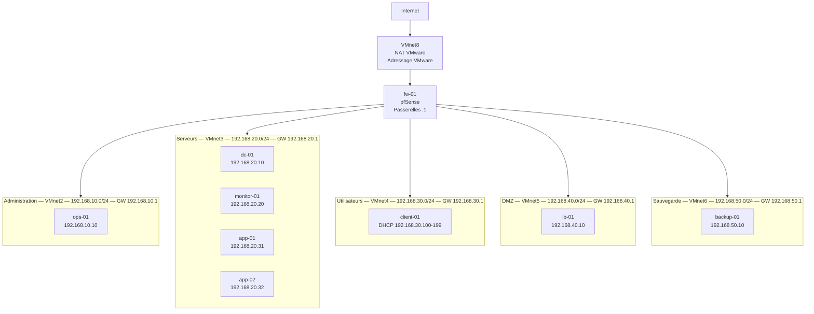

# Schéma réseau cible

Ce schéma décrit la segmentation VMware prévue. Aucun réseau VMnet n'a encore été créé ou modifié dans VMware.

```mermaid
flowchart TB
    INTERNET[Internet]
    NAT[VMnet8<br/>NAT VMware<br/>Adressage VMware]
    FW[fw-01<br/>pfSense<br/>Passerelles .1]

    INTERNET --> NAT --> FW

    subgraph ADMIN["Administration — VMnet2 — 192.168.10.0/24 — GW 192.168.10.1"]
        OPS[ops-01<br/>192.168.10.10]
    end

    subgraph SERVERS["Serveurs — VMnet3 — 192.168.20.0/24 — GW 192.168.20.1"]
        DC[dc-01<br/>192.168.20.10]
        MON[monitor-01<br/>192.168.20.20]
        APP1[app-01<br/>192.168.20.31]
        APP2[app-02<br/>192.168.20.32]
    end

    subgraph USERS["Utilisateurs — VMnet4 — 192.168.30.0/24 — GW 192.168.30.1"]
        CLIENT[client-01<br/>DHCP 192.168.30.100-199]
    end

    subgraph DMZ["DMZ — VMnet5 — 192.168.40.0/24 — GW 192.168.40.1"]
        LB[lb-01<br/>192.168.40.10]
    end

    subgraph BACKUPS["Sauvegarde — VMnet6 — 192.168.50.0/24 — GW 192.168.50.1"]
        BACKUP[backup-01<br/>192.168.50.10]
    end

    FW --> ADMIN
    FW --> SERVERS
    FW --> USERS
    FW --> DMZ
    FW --> BACKUPS
```
