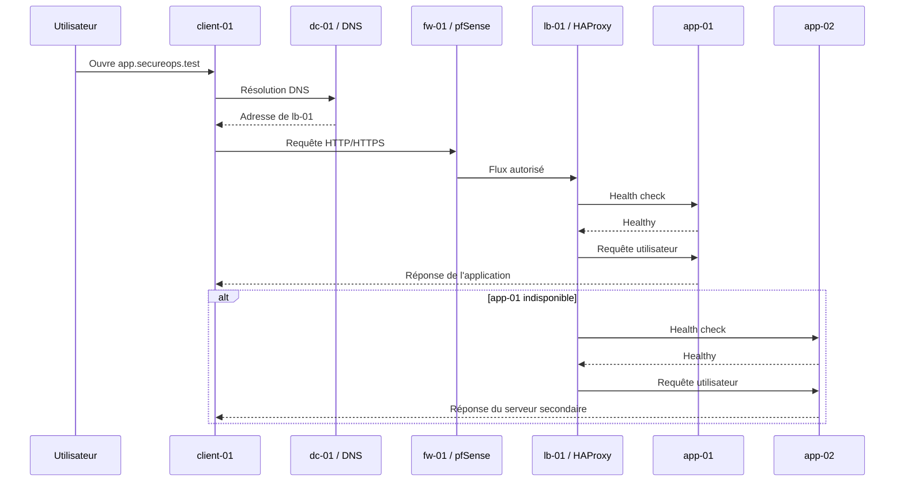

# Flux utilisateur vers l'application

Ce diagramme décrit le chemin cible d'un utilisateur vers l'application. L'application et HAProxy seront configurés dans une étape ultérieure.

```mermaid
sequenceDiagram
    participant User as Utilisateur
    participant Client as client-01
    participant DNS as dc-01 / DNS
    participant FW as fw-01 / pfSense
    participant LB as lb-01 / HAProxy
    participant App1 as app-01
    participant App2 as app-02

    User->>Client: Ouvre app.secureops.test
    Client->>DNS: Résolution DNS
    DNS-->>Client: Adresse de lb-01
    Client->>FW: Requête HTTP/HTTPS
    FW->>LB: Flux autorisé
    LB->>App1: Health check
    App1-->>LB: Healthy
    LB->>App1: Requête utilisateur
    App1-->>Client: Réponse de l'application

    alt app-01 indisponible
        LB->>App2: Health check
        App2-->>LB: Healthy
        LB->>App2: Requête utilisateur
        App2-->>Client: Réponse du serveur secondaire
    end
```
