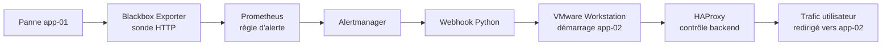

# Flux de basculement automatique prévu

Ce document décrit une automatisation future. Elle n'existe pas encore et ne sera pas configurée pendant la phase de conception.

## Principe prévu

Lorsqu'une panne de `app-01` sera détectée, une sonde Blackbox Exporter alimentera Prometheus. Une règle d'alerte pourra déclencher Alertmanager, qui appellera un webhook Python. Ce webhook pourra ensuite lancer une action contrôlée sur VMware, vérifier l'état de `app-02`, puis laisser HAProxy rediriger le trafic vers le serveur disponible.

Cette logique sera validée beaucoup plus tard, après la création des machines, le déploiement de l'application, la mise en place de la supervision et les tests de panne.
